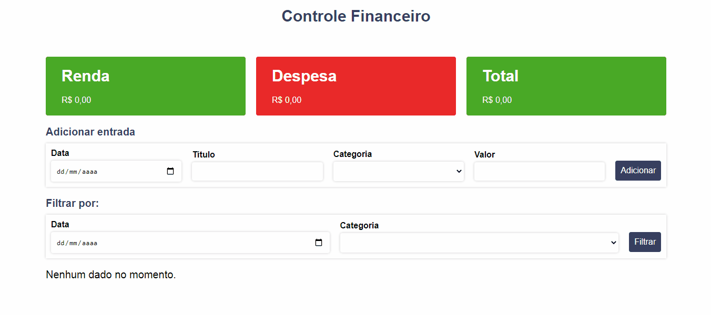

# Finance Control

<h1 align="center">Sobre o projeto</h1>

Aplicação construida como projeto final da disciplina de Desenvolvimento de Sites para web da faculdade de Tecnologia em Sistemas para Internet que consiste em um controle financeiro.

<h2 align="center">Tecnologias Utilizadas</h2>

Foram utilizados HTML, CSS, Javascript com Vue.js

Funcionalidades:

<ul>
  <li>Adicionar e remover uma entrada</li>
  <li>Filtrar uma entrada por data, categoria ou os dois.</li>
  <li>Os dados ficam salvos no localStorage do navegador.</li>
</ul>
 

<h2 align="center">Como utilizar</h2>

 Para utilizar o projeto em seu computador, é necessário ter: 

<ul>
  <li> Um editor de código</li>
  <li> Ter o node.js instalado</li>
  <li> Ter o git instalado </li>
</ul>

 Você depois pode clonar esse repositório através do comando: git clone https://github.com/Hamilton-junior/finance-control.git 

 Esse projeto foi criado utilizando <a href="https://vitejs.dev/guide/"> Vite </a>

 Abrindo o projeto no editor, utilizar o comando: npm install para instalar as dependências do projeto e depois o comando: npm run dev para rodar o projeto. 

<h2 align="center">Autor</h2>

<strong> Hamilton de Souza </strong>
 

